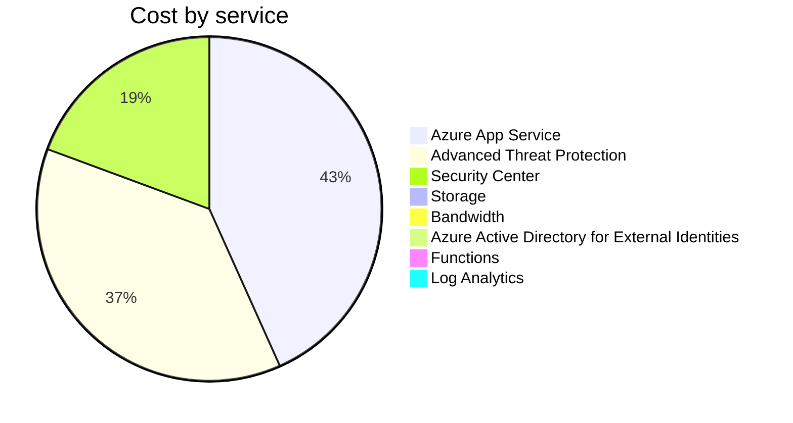
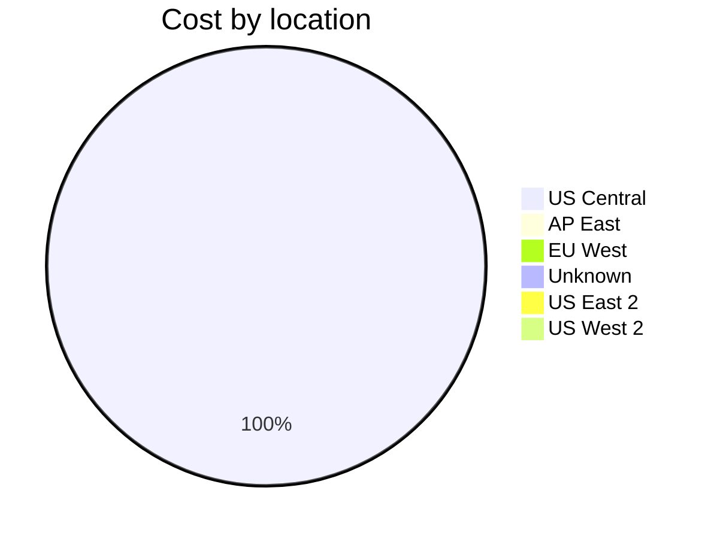
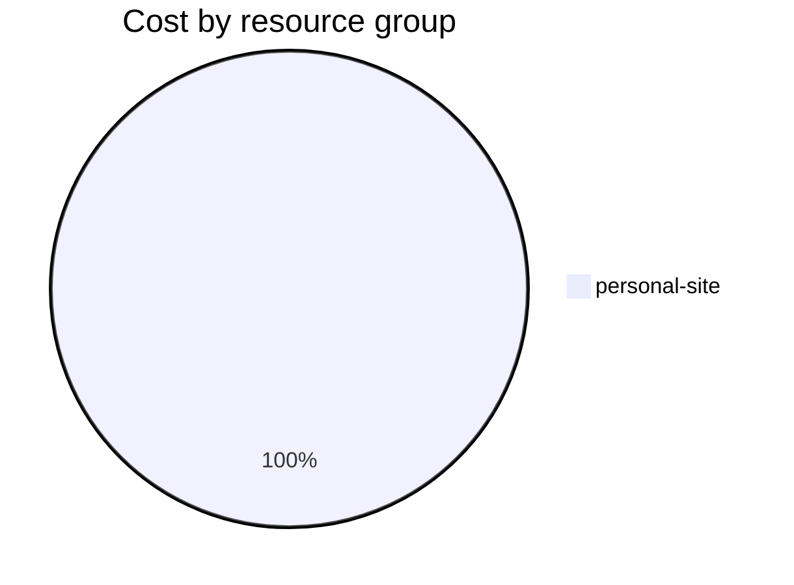

Fetching subscription details...
Fetching cost data...
Fetching forecasted cost data...
Fetching cost data by service name...
Fetching cost data by location...
Fetching cost data by resource group...
# Azure Cost Overview

> Accumulated cost for subscription id `JPF Pay-As-You-Go` from **09/01/2023** to **09/14/2023**

## Totals

|Period|Amount|
|---|---:|
|Today|0.00 USD|
|Yesterday|0.54 USD|
|Last 7 days|8.07 USD|
|Last 30 days|19.08 USD|

```mermaid
gantt
   title Accumulated cost
   dateFormat  X
   axisFormat %s
   section 01 Sep
   USD 1.57 :0, 157
   section 02 Sep
   USD 3.15 :0, 315
   section 03 Sep
   USD 4.72 :0, 472
   section 04 Sep
   USD 6.30 :0, 630
   section 05 Sep
   USD 7.87 :0, 787
   section 06 Sep
   USD 9.44 :0, 944
   section 07 Sep
   USD 11.01 :0, 1101
   section 08 Sep
   USD 12.59 :0, 1259
   section 09 Sep
   USD 14.16 :0, 1416
   section 10 Sep
   USD 15.73 :0, 1573
   section 11 Sep
   USD 17.30 :0, 1730
   section 12 Sep
   USD 17.94 :0, 1794
   section 13 Sep
   USD 18.53 :0, 1853
   section 14 Sep
   USD 19.08 :0, 1908
   section 15 Sep
   USD 20.51 : done, 0, 2051
   section 16 Sep
   USD 21.94 : done, 0, 2194
   section 17 Sep
   USD 23.37 : done, 0, 2337
   section 18 Sep
   USD 24.80 : done, 0, 2480
   section 19 Sep
   USD 26.23 : done, 0, 2623
   section 20 Sep
   USD 27.65 : done, 0, 2765
   section 21 Sep
   USD 29.07 : done, 0, 2907
   section 22 Sep
   USD 30.50 : done, 0, 3050
   section 23 Sep
   USD 31.92 : done, 0, 3192
   section 24 Sep
   USD 33.35 : done, 0, 3335
   section 25 Sep
   USD 34.77 : done, 0, 3477
   section 26 Sep
   USD 36.19 : done, 0, 3619
   section 27 Sep
   USD 37.60 : done, 0, 3760
   section 28 Sep
   USD 39.02 : done, 0, 3902
   section 29 Sep
   USD 40.44 : done, 0, 4044
   section 30 Sep
   USD 41.86 : done, 0, 4186
```

## By Service Name

|Service|Amount|
|---|---:|
|Azure App Service|8.23 USD|
|Advanced Threat Protection|7.10 USD|
|Security Center|3.68 USD|
|Storage|0.06 USD|
|Bandwidth|0.00 USD|
|Azure Active Directory for External Identities|0.00 USD|
|Functions|0.00 USD|
|Log Analytics|0.00 USD|

## By Location

|Location|Amount|
|---|---:|
|US Central|19.08 USD|
|AP East|0.00 USD|
|EU West|0.00 USD|
|Unknown|0.00 USD|
|US East 2|0.00 USD|
|US West 2|0.00 USD|

## By Resource Group

|Resource Group|Amount|
|---|---:|
|personal-site|19.08 USD|

Generated at 2023-09-15 11:36:15 for subscription with id `4913be3f-a345-4652-9bba-767418dd25e3`
